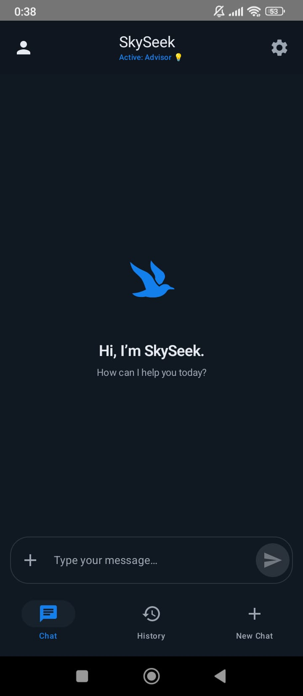
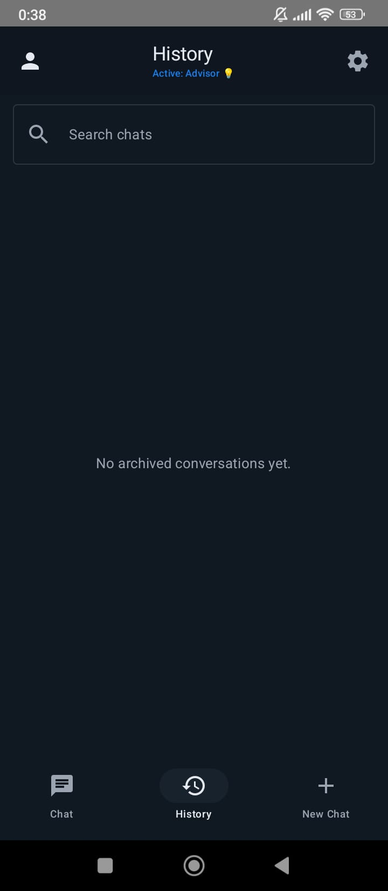
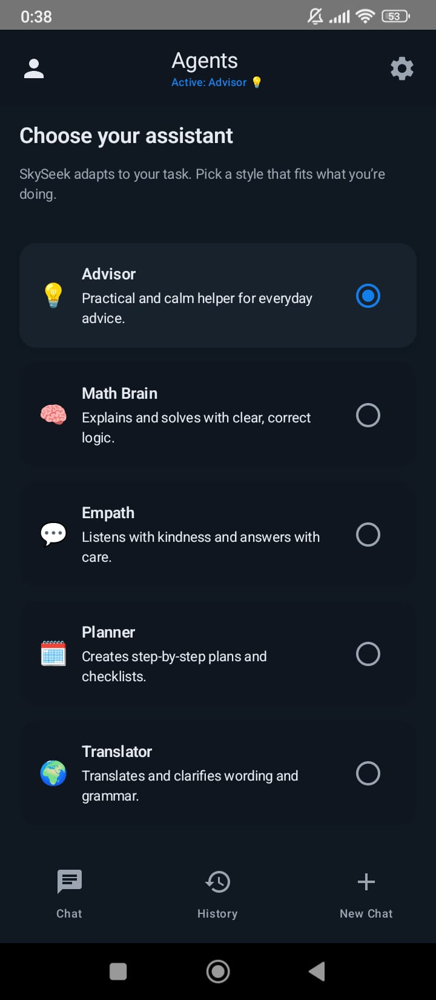
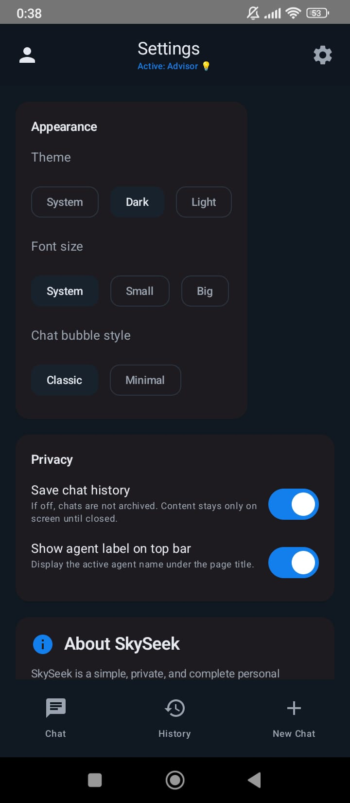

## 🌌 SkySeek for Android

  <!-- Replace these relative paths with your actual image filenames placed under /assets/readme/ -->

**A private, login‑free AI chat app powered by GPT‑5.**
Fast, clean conversations. No accounts. No tracking.

  <a href="https://1drv.ms/u/c/C6D9B4F0E148D4C6/EVWy6RyTTrFFtbapsWDrqzYBVWA7NA4jpjtjL2y5SxuRSA?e=rjkbKR"><b>⬇️ Download the latest APK</b></a> 
  Verified build · Signed and ready to sideload

---

## ✨ Why SkySeek?

* 🔐 **Private by design** — no logins, no analytics, no server‑side chat storage
* 🧠 **GPT‑5 responses** — fast, accurate, and streamed live
* 🧩 **Lightweight agents** — switch roles (General, Research, Code, Tutor) or create your own
* 🧼 **Beautifully simple UI** — distraction‑free chat, Markdown + code blocks, one‑tap copy/share
* 🗂️ **Local control** — chats stay on‑device; export/import when you want

> **Requirements:** Android 8.0 (Oreo) or newer · ~40–80 MB free space · Internet connection

---

## 🖼️ Screenshots

  
  
  

Captions

* **Chat:** live streaming responses with edit/resend of your last message.
* **Agents:** switch between General, Research, Code, Tutor — or create your own.
* **Settings:** one‑tap data wipe, export/import, and UI tweaks.

---

## 🧰 Key Features

* 🔓 **Zero sign‑in** — open the app and start chatting
* ⚡ **Live streaming replies** from GPT‑5
* 🧑‍💼 **Agents** — preset personas with tuned settings you can edit
* 📝 **Markdown rendering** + syntax‑highlighted code blocks
* ⌨️ **Keyboard‑first** UX, quick actions, edit/resend last message
* 💾 **Local backups** — export conversations to Markdown/JSON

---

## 📲 Installation (Sideloading)

1. **Download** the APK from the link above.
2. On your phone, open the file and tap **Install**.
3. If prompted, allow installs from your browser/file manager *(Settings → Security → Install unknown apps)*.

> **Updates:** install the new APK over the old one — your local chats remain intact.

---

## 🔒 Privacy

* No accounts. No telemetry. No third‑party analytics.
* Conversations are stored **only on your device** until you export them.
* Clear all data anytime: **Settings → Clear local data**.

Read the full policy in **[`PRIVACY.md`](PRIVACY.md)**.

---

## ❓ FAQ

**Do I need an account?**
No. SkySeek is completely login‑free.

**Is any data uploaded?**
No. Your conversations stay on your device unless you export or share them.

**Which model do you use?**
SkySeek is tuned for **GPT‑5**. Future builds may allow per‑agent model selection.

**iOS or desktop versions?**
On the roadmap — watch releases for updates.

---

## 🆕 What’s New

See the latest release notes on the **[Releases](releases)** page.

---

## 🛟 Support

* Bugs & feedback: open an issue in **Issues**
* Contact: **[di-code@outlook.com](mailto:di-code@outlook.com)**

---

## 🗺️ Roadmap

* Per‑agent tools (web search, calculators)
* End‑to‑end encrypted export bundles
* Theming & custom palettes
* iOS & desktop builds

---

## ⚖️ Legal

© SkySeek. All rights reserved. “GPT‑5” describes the model family used within the app. SkySeek is not affiliated with or endorsed by any third‑party provider.

